# RetroDev Studio — Mocks de UI/UX para aprovação

**Fase B — gate humano.** Estes artefatos não alteram o produto. Cada tela usa o mesmo sistema de tokens e o mesmo código estático compartilhado em [`shared/mock.css`](shared/mock.css) e [`shared/mock.js`](shared/mock.js), servido pelo Vite/Tailwind já existente no repositório. Nenhuma dependência foi adicionada.

## Revisão B2 — iconografia e áreas adaptáveis

Esta rodada incorpora o ajuste solicitado em 18/07/2026 em todas as superfícies:

- iconografia outline moderna baseada em um subconjunto local e inalterado do **Iconoir 7.11.1**, com licença MIT em [`shared/icons/LICENSE`](shared/icons/LICENSE), sem pacote ou chamada externa;
- áreas com divisores manuais acessíveis por mouse e teclado, além dos presets **Auto**, **Foco** e **Balanceado**;
- painéis encaixáveis, flutuantes, maximizáveis e recuperáveis por auto-ocultação;
- caixas informativas móveis, redimensionáveis, fixáveis e auto-ocultáveis;
- alertas críticos, erros e bloqueios de build permanecem persistentes e **nunca** são auto-ocultados;
- Command Palette continua automática e transitória, sem resize manual desnecessário.

Os HTMLs demonstram os controles e interações. Os PNGs “depois” registram o estado balanceado inicial.

## Como avaliar

- Compare 1366x768 primeiro: é a resolução com maior pressão de densidade.
- Use 1920x1080 para avaliar hierarquia e aproveitamento do espaço.
- A aprovação é por linha/tela. Aprovação parcial é válida e limitará a Fase C.
- `Experimental` foi preservado em Art, FX, Reverse e Parity/Cycle.

Os “antes” vêm do layout oracle desktop/Tauri real de 2026-06-28. Como o oracle atual não possui alvos próprios para Design System, Explorer, Console, Command Palette ou Reverse, esses cinco itens usam o baseline real mais próximo do shell/Debug; a lacuna está registrada na auditoria e será um gate a ampliar na Fase C.

## 1. Design system / primitives

Racional: transformar dez tokens pouco adotados e 3.908 hex em uma base semântica, com contraste, alvos, foco, iconografia e estados previsíveis. O specimen agora documenta também splitter, painel fixado/flutuante e aba auto-ocultável.

Impacto esperado: consistência transversal, migração verificável e preparação para tema claro futuro sem adicionar biblioteca.

| Antes | Depois |
|---|---|
| [1366x768](design-system/before-1366x768.png) · [1920x1080](design-system/before-1920x1080.png) | [1366x768](design-system/after-1366x768.png) · [1920x1080](design-system/after-1920x1080.png) · [HTML](design-system/index.html) |

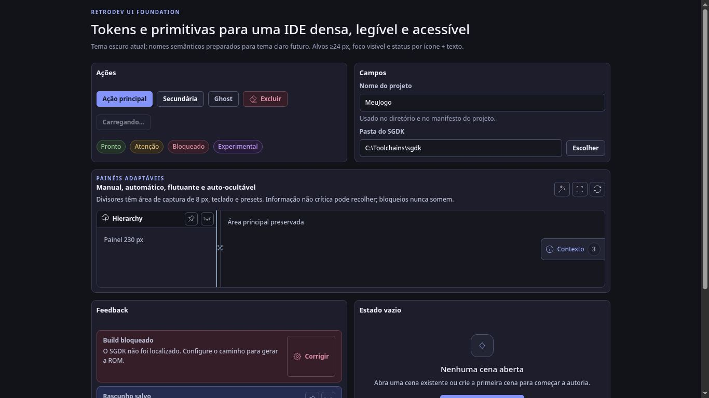

## 2. Wizard de primeiro uso

Racional: stepper Template → Plataforma/Destino → Revisão, importação externa como rota irmã e erro/retry no próprio diálogo. O usuário nunca precisa descobrir no Console por que “Criar Projeto” não avançou.

Impacto esperado: reduzir becos sem saída, manter o início pedagógico acima da dobra e encurtar o caminho ao primeiro playtest.

| Antes | Depois |
|---|---|
| [1366x768](wizard/before-1366x768.png) · [1920x1080](wizard/before-1920x1080.png) | [1366x768](wizard/after-1366x768.png) · [1920x1080](wizard/after-1920x1080.png) · [HTML](wizard/index.html) |

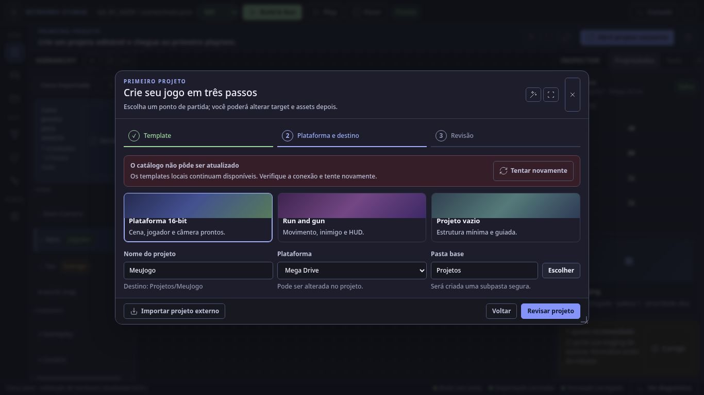

## 3. Scene shell

Racional: preservar o shell de três painéis, mas fixar ferramentas primárias, mover overlays/visualização para disclosure, condensar a guia da Hierarchy e apresentar Build bloqueado fora do canvas com CTA de recuperação.

Impacto esperado: mais área útil em 1366, menor obstrução do stage, leitura de seleção/hardware mais rápida e toolbar previsível.

| Antes | Depois |
|---|---|
| [1366x768](scene/before-1366x768.png) · [1920x1080](scene/before-1920x1080.png) | [1366x768](scene/after-1366x768.png) · [1920x1080](scene/after-1920x1080.png) · [HTML](scene/index.html) |

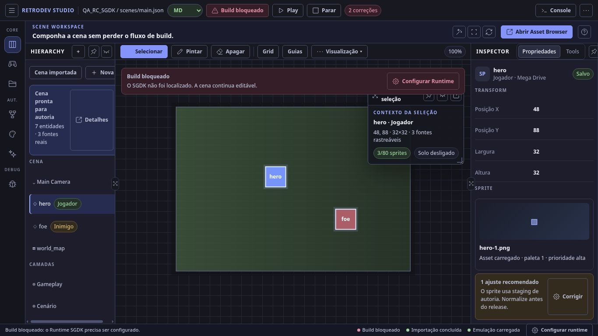

## 4. Game

Racional: manter canvas e escala inteira como centro, com controles essenciais persistentes e state/replay/rewind em “Mais controles”. O canvas recebe nome/instrução; target e resolução vêm do runtime real.

Impacto esperado: reduzir duplicidade com a topbar e tornar bloqueios/controles de emulação compreensíveis sem perder densidade de IDE.

| Antes | Depois |
|---|---|
| [1366x768](game/before-1366x768.png) · [1920x1080](game/before-1920x1080.png) | [1366x768](game/after-1366x768.png) · [1920x1080](game/after-1920x1080.png) · [HTML](game/index.html) |

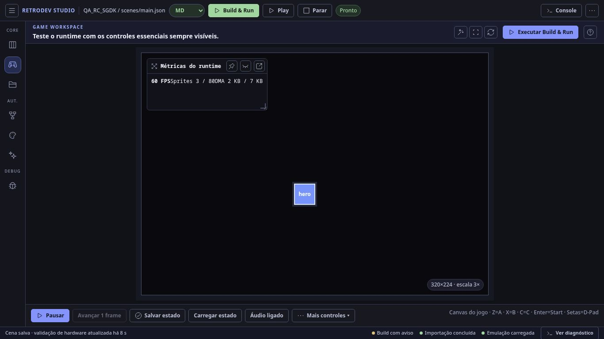

## 5. Explorer / Asset Browser

Racional: convergir árvore, grade, preview e ações canônicas em um único modelo. O item selecionado pode ser instanciado, aberto no Art ou focado por referência com ações explícitas, sem depender de duplo clique.

Impacto esperado: remover a sensação de dois catálogos concorrentes e tornar empty/error/selection acessíveis por teclado.

| Antes do shell mais próximo* | Depois |
|---|---|
| [1366x768](explorer/before-1366x768.png) · [1920x1080](explorer/before-1920x1080.png) | [1366x768](explorer/after-1366x768.png) · [1920x1080](explorer/after-1920x1080.png) · [HTML](explorer/index.html) |

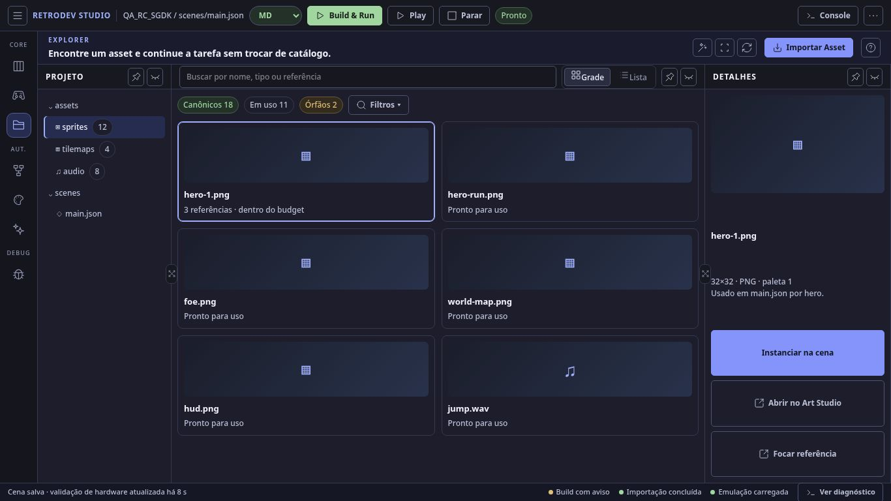

## 6. Logic / NodeGraph

Racional: palette semântica, canvas focável e rail dividido em Resumo/Problemas/Fonte. O mock explicita alternativas de teclado para adicionar, mover, conectar e excluir, além de preservar avisos heurísticos e feedback de hardware.

Impacto esperado: impedir exclusão acidental durante digitação, reduzir mural lateral e dar equivalência ao fluxo de drag.

| Antes | Depois |
|---|---|
| [1366x768](logic/before-1366x768.png) · [1920x1080](logic/before-1920x1080.png) | [1366x768](logic/after-1366x768.png) · [1920x1080](logic/after-1920x1080.png) · [HTML](logic/index.html) |

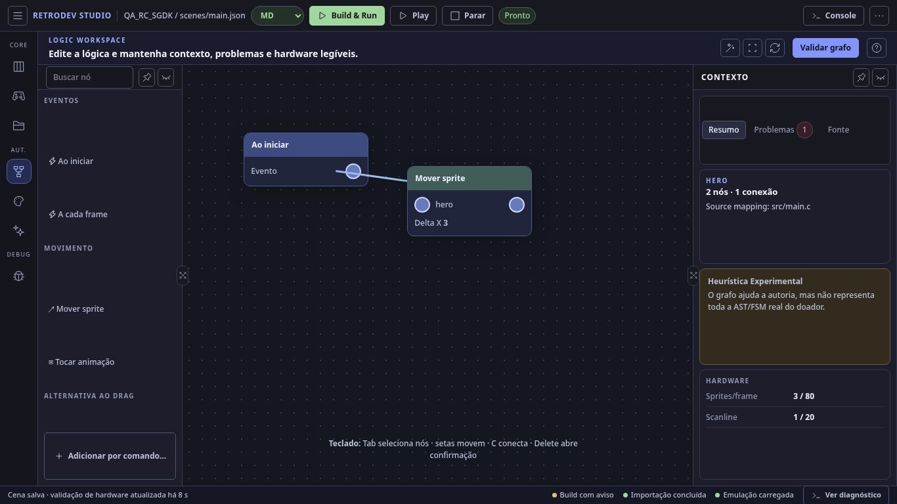

## 7. Art + FX (`Experimental`)

Racional: source e timeline ocupam a área central; Preview/Animação/Exportar/Diagnóstico viram tabs no Inspector e as ações finais ficam visíveis. RetroFX compartilha o mesmo contrato de tabs, dirty state, salvar/retry e reorder alternativo.

Impacto esperado: eliminar overflow horizontal persistente, reduzir a coluna contínua de metadados e preservar honestamente a maturidade Experimental.

| Antes | Depois |
|---|---|
| [1366x768](art-fx/before-1366x768.png) · [1920x1080](art-fx/before-1920x1080.png) | [1366x768](art-fx/after-1366x768.png) · [1920x1080](art-fx/after-1920x1080.png) · [HTML](art-fx/index.html) |

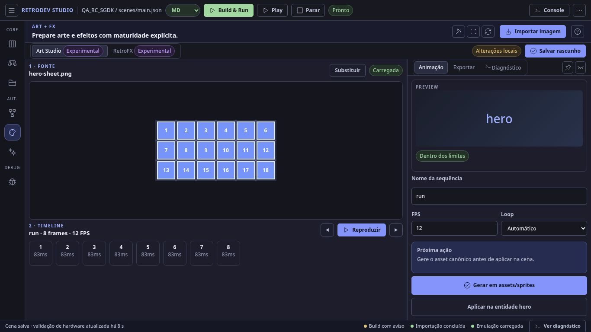

## 8. Debug / Tools

Racional: a navegação responde à largura real do container; em dock estreito, não mantém uma sidebar de 230 px mais um grid de seis colunas. Categoria, ferramenta e maturidade permanecem explícitas.

Impacto esperado: eliminar compressão/clipping em 1366 e estabelecer um padrão único para Runtime, Profiler, Memory, VRAM e ferramentas experimentais.

| Antes | Depois |
|---|---|
| [1366x768](debug-tools/before-1366x768.png) · [1920x1080](debug-tools/before-1920x1080.png) | [1366x768](debug-tools/after-1366x768.png) · [1920x1080](debug-tools/after-1920x1080.png) · [HTML](debug-tools/index.html) |

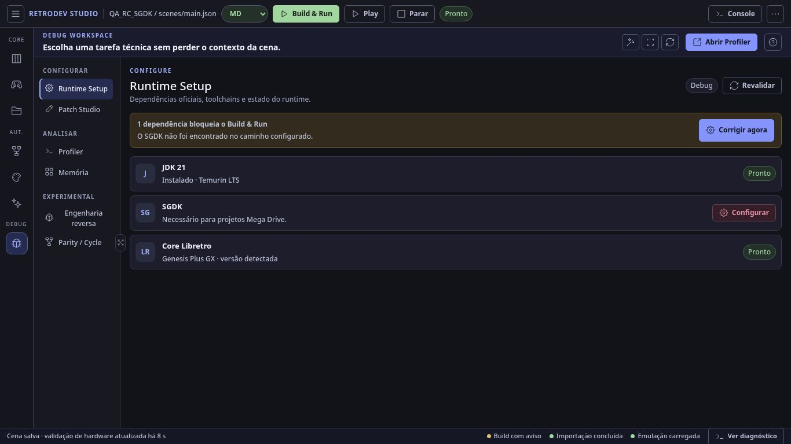

## 9. Runtime Setup

Racional: separar loading/error/ready/installing, mostrar progresso por dependência e converter a falha em microcopy “O que quebrou / Por que importa / Onde corrigir / Próxima ação”. A confirmação nativa será substituída por Dialog no escopo aprovado.

Impacto esperado: nunca confundir erro de consulta com “0 dependências” e recuperar Build & Run sem caça ao log.

| Antes | Depois |
|---|---|
| [1366x768](runtime-setup/before-1366x768.png) · [1920x1080](runtime-setup/before-1920x1080.png) | [1366x768](runtime-setup/after-1366x768.png) · [1920x1080](runtime-setup/after-1920x1080.png) · [HTML](runtime-setup/index.html) |

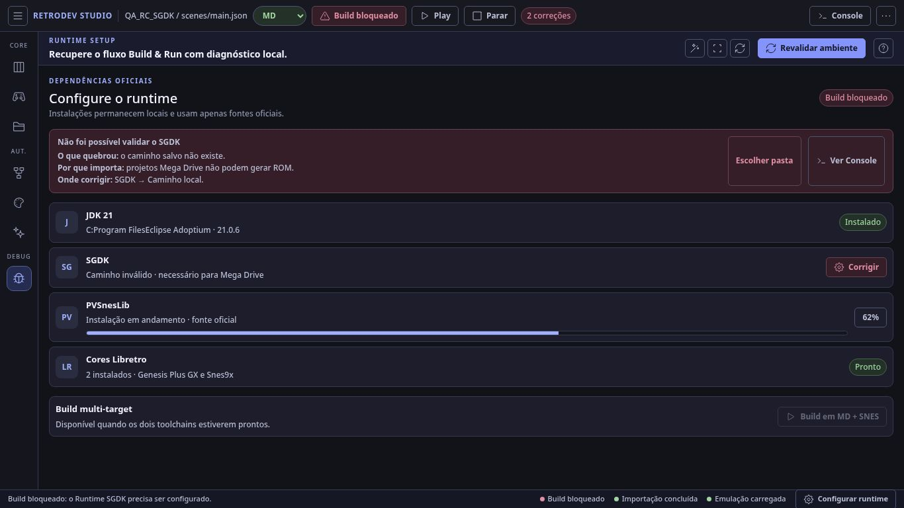

## 10. Console + estados globais

Racional: selecionar automaticamente o diagnóstico correspondente, pausar follow quando o usuário lê, mostrar “novas mensagens”, trocar link falso por ações reais e transformar status bar em quatro segmentos acionáveis.

Impacto esperado: acelerar recuperação de falha e impedir que novos logs interrompam investigação.

| Antes do shell mais próximo* | Depois |
|---|---|
| [1366x768](console-states/before-1366x768.png) · [1920x1080](console-states/before-1920x1080.png) | [1366x768](console-states/after-1366x768.png) · [1920x1080](console-states/after-1920x1080.png) · [HTML](console-states/index.html) |

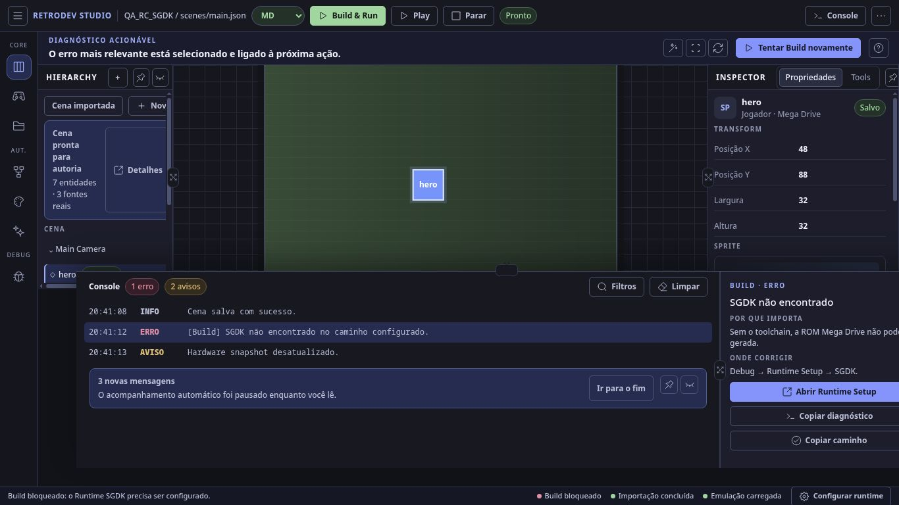

## 11. Command Palette + Dialog

Racional: resultados agrupados, indisponibilidade explicada e ação de desbloqueio. O Dialog compartilhado estabelece foco inicial, trap, Esc, restauração de foco e semântica ARIA para Wizard/Sobre/Atalhos/Settings/confirmar.

Impacto esperado: tornar o teclado um caminho de primeira classe e evitar que um item opaco seja interpretado como defeito.

| Antes do shell mais próximo* | Depois |
|---|---|
| [1366x768](command-dialog/before-1366x768.png) · [1920x1080](command-dialog/before-1920x1080.png) | [1366x768](command-dialog/after-1366x768.png) · [1920x1080](command-dialog/after-1920x1080.png) · [HTML](command-dialog/index.html) |

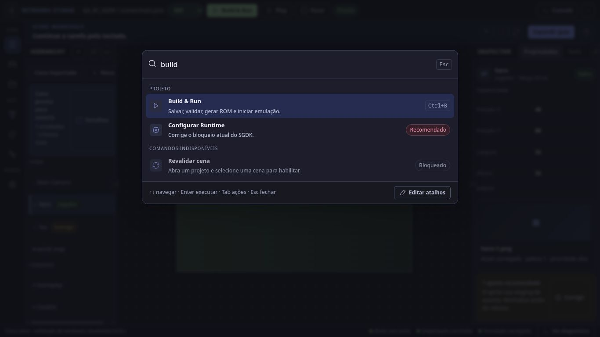

## 12. Reverse + Laboratório de Evidências (`Experimental`)

Racional: reunir readiness, inputs comuns, resultado, divergências, limitações e arquivos sem colapsar Parity/Cross-Core/Cycle em uma promessa única. Reverse mantém tabs próprias e usa o mesmo sistema de navegação/formulário.

Impacto esperado: evidência mais auditável, menos caminhos digitados/repetidos e limitações visíveis; nenhuma promoção de maturidade nem claim de equivalência 1:1/cycle accuracy.

| Antes do Debug mais próximo* | Depois |
|---|---|
| [1366x768](reverse-evidence/before-1366x768.png) · [1920x1080](reverse-evidence/before-1920x1080.png) | [1366x768](reverse-evidence/after-1366x768.png) · [1920x1080](reverse-evidence/after-1920x1080.png) · [HTML](reverse-evidence/index.html) |

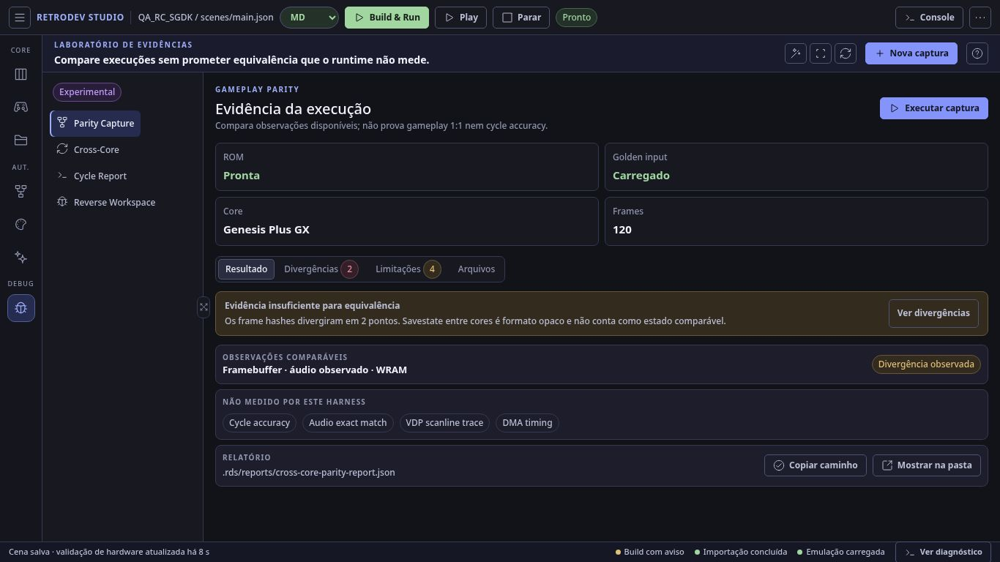

## Validação da Fase B2

- 12 HTMLs servidos localmente com resposta 200 e sem recursos externos em HTML, CSS ou JavaScript;
- 48 evidências normalizadas como PNG real, nas dimensões exatas 1366x768 e 1920x1080;
- 39 ícones vetoriais locais com licença preservada e nenhuma máscara ausente nos renders inspecionados;
- presets Auto, Foco e Balanceado exercitados; o modo Foco preservou o centro e recolheu os painéis laterais para 48 px;
- resize por divisores, restauração balanceada e auto-ocultação da caixa Contexto exercitados por interação;
- 12 telas sem overflow de documento nos dois viewports; alertas críticos permaneceram persistentes.

## Gate de aprovação por tela

Responda com `Aprovo: 1, 2, 3...` e, para cada tela a ajustar, indique o número e a mudança. A Fase C começará somente nas telas explicitamente aprovadas.

| # | Tela | Decisão |
|---:|---|---|
| 1 | Design system / primitives | Pendente |
| 2 | Wizard | Pendente |
| 3 | Scene shell | Pendente |
| 4 | Game | Pendente |
| 5 | Explorer / Asset Browser | Pendente |
| 6 | Logic / NodeGraph | Pendente |
| 7 | Art + FX Experimental | Pendente |
| 8 | Debug / Tools | Pendente |
| 9 | Runtime Setup | Pendente |
| 10 | Console + estados globais | Pendente |
| 11 | Command Palette + Dialog | Pendente |
| 12 | Reverse + Laboratório de Evidências Experimental | Pendente |

**Decisão extra necessária:** nenhuma. Não há dependência nova nestes mocks; o subconjunto Iconoir é um ativo estático local sob MIT.
