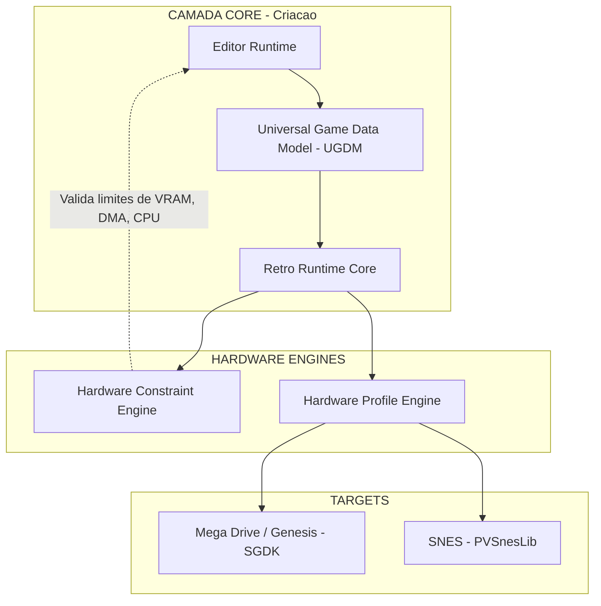

# RetroDev Studio

> Plataforma desktop para desenvolvimento, preservacao e engenharia reversa de jogos 16-bits.


---

## Estado Real

- Data de referencia: 2026-03-03.
- Fase ativa real: hardening do fluxo `Build -> ROM -> Emulacao`, ja validado em Windows com upstream real, E2E desktop local e workflow GitHub/Windows multi-target.
- `Fase 0` esta concluida e verificada.
- `Fases 1 e 2` ja foram validadas em Windows com toolchains e cores upstream reais e agora estao em hardening.
- `Fases 3 e 4` existem no editor, porem parte das superficies continuam `Experimental` ou congeladas ate o core ser fechado.
- Se este README divergir do estado operacional, prevalecem `docs/06_AI_MEMORY_BANK.md`, `docs/03_ROADMAP_MVP.md` e `docs/09_AGENT_DEV_MODE.md`.

## O Que Ja Existe No Codigo

- Editor desktop com Tauri + React + TypeScript funcional.
- Persistencia canonica de `project.rds` e `scenes/*.json`, com escrita atomica no backend Rust.
- Build orchestration real por target para `megadrive` e `snes`, com workspace, staging e deteccao de ROM.
- Emulacao integrada via Libretro FFI no Rust.
- Instalacao sob demanda de SGDK, PVSnesLib e cores Libretro oficiais no Windows.
- CI com validacao estrutural, lint, typecheck, `cargo clippy`, testes frontend e testes Rust.

## O Que Ainda Falta Para Fechar O MVP

- Tornar repetivel o baseline de validacao oficial em Windows para mudancas sensiveis de build/emulacao/toolchain.
- Decidir se o workflow desktop dedicado permanece em `push`/`pull_request` path-filtered ou migra para gate protegido por ambiente.
- Auditar handlers async residuais fora do endurecimento ja aplicado em abertura de projeto e salvamento de cena.
- Retomar apenas depois disso as superficies hoje marcadas como `Experimental`.

## Arquitetura De Alto Nivel



## Estrutura Do Projeto

```text
RetroDevStudio/
|
|-- .github/
|   `-- workflows/
|       |-- ci.yml
|       `-- desktop-e2e.yml
|
|-- README.md
|-- CLAUDE.md
|-- eslint.config.mjs
|-- package.json
|-- vite.config.ts
|-- data/
|   |-- rom_teste.bin
|   `-- sonic_test.gen
|
|-- docs/
|   |-- 00_AI_DIRECTIVES.md
|   |-- 01_PRD_MASTER.md
|   |-- 02_TECH_STACK.md
|   |-- 03_ROADMAP_MVP.md
|   |-- 04_HARDWARE_SPECS.md
|   |-- 05_ARCHITECTURE_UGDM.md
|   |-- 06_AI_MEMORY_BANK.md
|   |-- 07_TEST_AND_COMPLIANCE.md
|   |-- 08_TREE_ARCHITECTURE.md
|   `-- 09_AGENT_DEV_MODE.md
|
|-- scripts/
|   |-- bootstrap.ps1
|   |-- check-tree.cjs
|   |-- check-tree.ps1
|   `-- e2e-tauri-build-run.mjs
|
|-- src/
|   `-- ...
|
|-- src-tauri/
|   `-- ...
|
`-- toolchains/
    `-- ...
```

## Orientacao Para Agentes De IA

- Ponto de entrada unico: `docs/00_AI_DIRECTIVES.md`.
- Hierarquia de verdade para conflito documental:
  `docs/06_AI_MEMORY_BANK.md` -> `docs/03_ROADMAP_MVP.md` -> `docs/09_AGENT_DEV_MODE.md` -> `docs/08_TREE_ARCHITECTURE.md` -> `docs/02_TECH_STACK.md` -> `docs/07_TEST_AND_COMPLIANCE.md` -> `README.md` / `CLAUDE.md`.
- Nenhum agente deve declarar feature como pronta se ela estiver parcial, experimental, sem gate ou sem validacao oficial quando exigida.

**Prompt de inicializacao recomendado**

```text
Iniciando nova sessao no RetroDev Studio.
Leia primeiro docs/00_AI_DIRECTIVES.md.
Depois: docs/06_AI_MEMORY_BANK.md, docs/03_ROADMAP_MVP.md e docs/08_TREE_ARCHITECTURE.md.
Se a tarefa tocar processo, CI, estado documental ou conflito entre documentos, leia tambem docs/09_AGENT_DEV_MODE.md.
Responda com "[Contexto Carregado]" e proponha o plano de acao.
```

## Gates Minimos De Validacao

- `npm run check:tree`
- `npm run lint`
- `npx tsc --noEmit`
- `npm test`
- `cargo clippy -- -D warnings`
- `cargo test --lib -- --nocapture`
- Validacao manual com dependencias oficiais quando a mudanca tocar build, emulacao ou toolchains reais.

## Roadmap De Desenvolvimento

| Fase | Objetivo | Status real |
|------|---------|-------------|
| **Fase 0: Fundacao** | Setup Tauri + React + Rust | Concluida e verificada |
| **Fase 1: Core Mega Drive** | Gerar ROM jogavel a partir do editor | Validada em Windows, em hardening |
| **Fase 2: Abstracao (SNES)** | Provar engine agnostica | Validada em Windows, em hardening |
| **Fase 3: Visual Logic** | NodeGraph e RetroFX | Implementada no editor, congelada ate fechar o core |
| **Fase 4: Camada Pro** | Engenharia Reversa e Profiler | Implementada no editor, com superficies experimentais/parciais |

Para detalhes e sprint atual, consulte `docs/03_ROADMAP_MVP.md`.

## Tech Stack

| Camada | Tecnologia |
|--------|-----------|
| Desktop Framework | Tauri 2 |
| Frontend | React + TypeScript + Vite + TailwindCSS + Zustand |
| Backend / Core | Rust |
| Emulacao | Libretro API via FFI |
| Mega Drive SDK | SGDK |
| SNES SDK | PVSnesLib |
| Formato de Dados | JSON `.rds` (UGDM) |
| Validacao de Processo | `check-tree.cjs`, ESLint, TypeScript `--noEmit`, `cargo clippy`, suites de teste |

## Aviso Legal & Compliance

- O software nao distribui ROMs comerciais.
- O usuario traz a propria ROM quando usar superfices de engenharia reversa.
- A camada de modificacao em ROM comercial deve privilegiar patches diferenciais, como IPS e BPS.
- SDKs e cores de terceiros devem ser baixados do upstream oficial, sob demanda e com consentimento do usuario.

Para detalhes completos, consulte `docs/07_TEST_AND_COMPLIANCE.md`.
