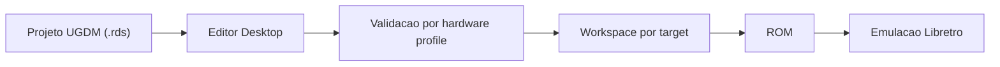

# RetroDev Studio

> Plataforma desktop para desenvolvimento, preservacao e engenharia reversa de jogos 16-bit, com foco atual em Mega Drive e SNES.


---

## Estado Atual

- Fase ativa real: `release candidate / beta tecnica em hardening`.
- Fotografia atual em `main`: PR #5 mergeado em `a31357072c93431ce441ff51a88a51004365ca88`; `npm run release:readiness:promotion` passou com `Pronto para promocao: SIM`.
- O foco atual nao e abrir escopo novo; e manter o fluxo canonico `Build -> ROM -> Emulacao` repetivel e documentado com honestidade.
- O estado operacional canonico fica em [docs/06_AI_MEMORY_BANK.md](./docs/06_AI_MEMORY_BANK.md).
- A matriz permanente de fases, superficies e importadores fica em [docs/03_ROADMAP_MVP.md](./docs/03_ROADMAP_MVP.md).
- As regras de processo e sincronizacao documental ficam em [docs/09_AGENT_DEV_MODE.md](./docs/09_AGENT_DEV_MODE.md).

Se este `README` divergir do estado real, prevalecem:
`docs/06_AI_MEMORY_BANK.md` -> `docs/03_ROADMAP_MVP.md` -> `docs/09_AGENT_DEV_MODE.md`.

---

## O Produto Hoje

RetroDev Studio ja passou de prototipo. O produto hoje consegue:

- criar e abrir projetos `.rds`
- editar cena e ativos
- compilar ROM para `Mega Drive` e `SNES`
- carregar ROM no emulador integrado
- validar o caminho principal por gates locais, readiness e smoke desktop

O produto ainda nao deve ser descrito como engine totalmente pronta para producao comercial. A prioridade atual e consistencia, ergonomia e repetibilidade dos fluxos certificados.

Na frente SGDK/no-code, o PR #5 removeu fake da prova Stable e foi integrado em `main`. O jogo no-code real e gerado 100% por nodes, compila com SGDK oficial, gera ROM persistente e roda no Genesis Plus GX; o corpus real cobre 122 projetos, com 68 builds/ROMs/emulacoes reais e 54 bridges formais; `BLAZE_ENGINE` tem modo compativel real com build, ROM e emulacao. A exposicao publica de maturidade ainda deve seguir o roadmap e as badges reais da UI, sem promocao automatica de superficies experimentais.

GameMaker agora tem adapter **Experimental** importavel para GMX/GMZ/GMEZ: rooms, instances, sprites e objetos viram cena UGDM editavel, e GML fica preservado como bridge semantica visivel. Isto ainda nao significa conversao GameMaker completa para SGDK/ROM; essa promocao exige build SGDK, ROM, emulacao e relatorio de equivalencia dedicados.

---

## Fluxo Canonico

```text
Projeto (.rds / UGDM)
    -> editor desktop
    -> validacao por hardware profile
    -> build workspace por target
    -> ROM
    -> emulacao Libretro
```



### Targets atuais

- `megadrive` -> `SGDK`
- `snes` -> `PVSnesLib`

### Stack principal

| Camada | Tecnologia |
|--------|------------|
| Desktop | Tauri 2 |
| Frontend | React + TypeScript + Vite + TailwindCSS + Zustand |
| Backend | Rust |
| Emulacao | Libretro via FFI |
| Mega Drive SDK | SGDK |
| SNES SDK | PVSnesLib |
| Modelo de dados | UGDM JSON (`.rds`, `scenes/*.json`) |

---

## Superficies Visiveis

### Core ja integrado ao fluxo principal

- Menu inicial / criacao e abertura de projetos `.rds`
- Scene workspace com `Hierarchy`, `Layers`, `Inspector` e pintura real de tilemap (pencil/eraser/picker/rect/fill) com WYSIWYG do atlas
- Game workspace com `Build & Run` e emulador integrado
- Explorer workspace
- Logic workspace / NodeGraph canonico (certificacao local, sem prova institucional dedicada ainda)
- Debug workspace com `Runtime Setup`, `Patch Studio`, `Paleta Contextual` e `Deep Profiler`

### Ainda marcadas como `Experimental`

- Asset Browser
- ArtStudio
- RetroFX
- Reverse Workspace
- Asset Extractor
- Memory Viewer
- VRAM Viewer
- Importadores externos fora do eixo principal do MVP
  - GameMaker GMX/GMZ/GMEZ: Experimental/importavel, com GML preservado como bridge

Essas superficies existem de verdade no produto, mas continuam com rotulo de maturidade controlado para nao prometer mais do que o fluxo atual entrega. A lista canonica e mais detalhada fica no roadmap central.

---

## Windows Limpo

Para subir o projeto de forma conservadora em um host Windows novo:

1. `npm ci`
2. `powershell -NoProfile -ExecutionPolicy Bypass -File scripts\bootstrap.ps1`
3. `powershell -NoProfile -ExecutionPolicy Bypass -File scripts\validate-upstream-windows.ps1 -SkipRustTests`

O bootstrap atual nao cria scaffold, nao reescreve arquivos do repositorio e pode opcionalmente rodar o baseline completo do projeto.

Para uma fotografia consolidada de readiness no Windows:

1. `npm run release:readiness:baseline`
2. inspecionar `src-tauri/target-test/validation/release-readiness.md`

Para a rodada institucional de promocao RC:

1. `npm run test:e2e:desktop:qa-rc`
2. `npm run release:readiness:promotion`
3. inspecionar `src-tauri/target-test/validation/manual-qa-status.json`
4. inspecionar `src-tauri/target-test/validation/release-readiness.md`

---

## Documentos De Verdade

- [docs/06_AI_MEMORY_BANK.md](./docs/06_AI_MEMORY_BANK.md): estado operacional real, prioridade imediata e entrada canonica.
- [docs/03_ROADMAP_MVP.md](./docs/03_ROADMAP_MVP.md): fases, superficies e importadores com matriz central de maturidade.
- [docs/09_AGENT_DEV_MODE.md](./docs/09_AGENT_DEV_MODE.md): regras de processo, sincronizacao documental e gates.
- [docs/07_TEST_AND_COMPLIANCE.md](./docs/07_TEST_AND_COMPLIANCE.md): compliance, readiness e validacao oficial.
- [docs/08_TREE_ARCHITECTURE.md](./docs/08_TREE_ARCHITECTURE.md): organizacao canonica de arquivos.
