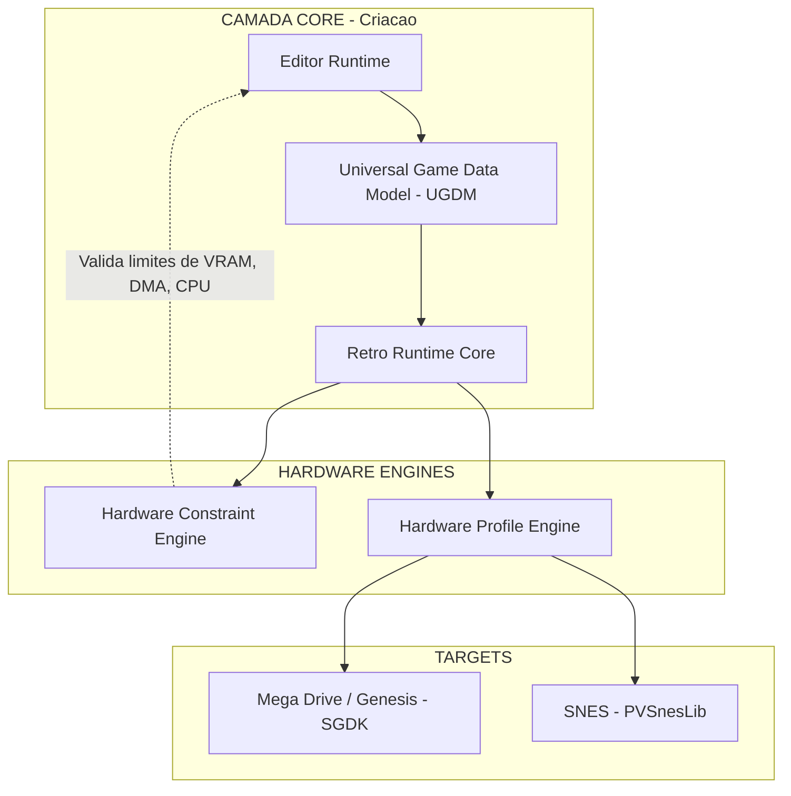

# RetroDev Studio

> **A plataforma definitiva para desenvolvimento, preservacao e engenharia reversa de jogos 16-bits.**


-orange.svg)


---

## Sobre o Projeto

O **RetroDev Studio** e uma infraestrutura completa para desenvolvimento retro moderno. A missao e democratizar a criacao de jogos para consoles de 16-bits (Mega Drive, SNES), trazendo a produtividade de engines modernas (Unity, Godot) para as restricoes do hardware original.

**Os 4 Pilares:**

1. **Criacao Moderna:** Editor visual, Nodes logicos e Hot-Reload.
2. **Precisao de Hardware:** Constraint Engine que impede voce de quebrar os limites reais do console.
3. **Engenharia Reversa:** Ferramentas limpas para estudo e modificacao de jogos classicos.
4. **Compliance Legal:** Workflow baseado em patches (sem distribuicao de ROMs comerciais).

---

## Arquitetura de Alto Nivel



**Componentes Chave:**

- **UGDM (Universal Game Data Model):** Representacao agnostica do jogo em JSON. Nao pertence a nenhum console — pertence a matematica do RetroDev.
- **Hardware Constraint Engine:** Se voce colocar 81 sprites na tela do Mega Drive (que so suporta 80), o editor avisa em tempo real.
- **Hardware Profile Engine:** Traduz o UGDM agnostico para o codigo nativo de cada console.

---

## Estrutura do Projeto

```text
RetroDev_Studio/
├── .cursorrules               # Regras comportamentais para IA (Cursor)
├── CLAUDE.md                  # Regras comportamentais para IA (Claude Code)
├── README.md                  # Este arquivo
├── docs/                      # Base de Conhecimento (LEITURA OBRIGATORIA)
│   ├── 00_AI_DIRECTIVES.md    # Ponto de entrada para QUALQUER IA
│   ├── 01_PRD_MASTER.md       # Visao Definitiva do Produto
│   ├── 02_TECH_STACK.md       # Tecnologias escolhidas e restricoes
│   ├── 03_ROADMAP_MVP.md      # Fases de desenvolvimento e Sprint atual
│   ├── 04_HARDWARE_SPECS.md   # Limites matematicos dos consoles (imutavel)
│   ├── 05_ARCHITECTURE_UGDM.md# Especificacao do formato de dados universal
│   ├── 06_AI_MEMORY_BANK.md   # Diario de bordo — estado atual do projeto
│   ├── 07_TEST_AND_COMPLIANCE.md # Regras legais e de testes
│   └── 08_TREE_ARCHITECTURE.md   # Mapa de diretorios (onde colocar cada arquivo)
├── scripts/                   # Scripts de validacao
│   ├── check-tree.ps1         # Valida arvore (PowerShell)
│   └── check-tree.js          # Valida arvore (Node.js)
├── src/                       # Frontend (React/TypeScript) — a ser criado
└── src-tauri/                 # Backend (Rust/Tauri) — a ser criado
```

---

## Orientacao para Agentes de IA

> **Cursor, Codex, Claude, Trae, Bonsai, e qualquer outro agente:**
> Este repositorio e editado por multiplas IAs e por humanos.
> O ponto de entrada unico e `docs/00_AI_DIRECTIVES.md`. Leia-o antes de qualquer acao.

**Prompt de Inicializacao (copie e cole ao iniciar uma sessao):**

```
Iniciando nova sessao no RetroDev Studio. Leia primeiro docs/00_AI_DIRECTIVES.md.
Depois: docs/06_AI_MEMORY_BANK.md, docs/03_ROADMAP_MVP.md, docs/08_TREE_ARCHITECTURE.md.
Responda com "[Contexto Carregado]" e proponha o plano de acao.
```

---

## Roadmap de Desenvolvimento

| Fase | Objetivo | Status |
|------|---------|--------|
| **Fase 0: Fundacao** | Setup Tauri + React + Rust | EM ANDAMENTO |
| **Fase 1: Core Mega Drive** | Gerar ROM jogavel a partir do editor | Bloqueada |
| **Fase 2: Abstracao (SNES)** | Provar engine agnostica | Bloqueada |
| **Fase 3: Visual Logic** | NodeGraph e RetroFX | Bloqueada |
| **Fase 4: Camada Pro** | Engenharia Reversa e Profiler | Bloqueada |

Para detalhes de cada Sprint, consulte `docs/03_ROADMAP_MVP.md`.

---

## Tech Stack

| Camada | Tecnologia |
|--------|-----------|
| Desktop Framework | Tauri (Rust + WebView nativo) |
| Frontend | React + TypeScript + Vite + TailwindCSS |
| Backend / Core | Rust |
| Emulacao | Libretro API (Genesis Plus GX, Snes9x) via FFI |
| Mega Drive SDK | SGDK (GCC m68k-elf) |
| SNES SDK | PVSnesLib (WLA-DX) |
| Formato de Dados | JSON (.rds) — UGDM |

Para detalhes e restricoes, consulte `docs/02_TECH_STACK.md`.

---

## Aviso Legal & Compliance

- Nenhum asset ou ROM com direitos autorais esta incluido neste software.
- A Camada de Engenharia Reversa opera estritamente atraves de patches binarios (IPS/BPS).
- Esta e uma ferramenta educacional, de preservacao historica e para criacao de jogos independentes (Homebrews).

Para detalhes completos, consulte `docs/07_TEST_AND_COMPLIANCE.md`.

---

Feito com cafe e paixao pela era dos 16-bits.
