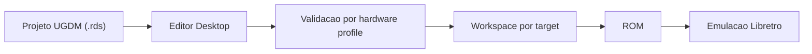

# RetroDev Studio

> Plataforma desktop para desenvolvimento, preservacao e engenharia reversa de jogos 16-bit, com foco atual em Mega Drive e SNES.


---

## Estado Real

- Data de referencia: `2026-04-04`.
- Fase ativa real: `hardening / QA do MVP desktop`, com foco em manter o fluxo canonico `Build -> ROM -> Emulacao` repetivel em host Windows limpo.
- O estado operacional canônico fica em [docs/06_AI_MEMORY_BANK.md](./docs/06_AI_MEMORY_BANK.md).
- Se este `README` divergir do estado real, prevalecem:
  `docs/06_AI_MEMORY_BANK.md` -> `docs/03_ROADMAP_MVP.md` -> `docs/09_AGENT_DEV_MODE.md`.

### O que esta certificado hoje

- Editor desktop com `Tauri + React + TypeScript + Rust`.
- Pipeline real por target para `Mega Drive` e `SNES`.
- Emulacao integrada via `Libretro`.
- Setup nativo sob demanda de `JDK`, `SGDK`, `PVSnesLib` e cores `Libretro` no Windows.
- Validacao oficial upstream em Windows via [scripts/validate-upstream-windows.ps1](./scripts/validate-upstream-windows.ps1).
- Smoke desktop local `Build -> ROM -> Run` via [scripts/e2e-tauri-build-run.mjs](./scripts/e2e-tauri-build-run.mjs).
- Build canonico local via `npm run build:debug`.
- `build-report.json` fresh-only por rodada, sem herdar modos antigos de outras execucoes.
- `npm run release:readiness:baseline` agora reroda automaticamente `build:debug`, `validate-upstream-windows` e `desktop E2E` em Windows apto, exigindo artefatos frescos da propria rodada.
- `npm run test:e2e:desktop:qa-rc` agora percorre os blocos `A-F` do roteiro RC no app desktop real e grava `src-tauri/target-test/validation/manual-qa-status.json` com screenshots `qa-rc-*.png`.
- `npm run release:readiness:promotion` agrega baseline, build/upstream, desktop E2E e o report `manual-qa-status.json` em modo `strict`.
- `src-tauri/target-test/validation/release-readiness.json` fechou esta rodada com `readyForPromotion = true` em `2026-04-04T03:07:15.245Z`, usando worktree limpo no commit `941b4dbefa5e6187a5d813e02b0254ada950213d`.
- Workflows do GitHub agora publicam sumario legivel e artefatos de validacao para auditoria por push.
- Bootstrap seguro para host limpo via [scripts/bootstrap.ps1](./scripts/bootstrap.ps1).
- Baseline recertificada neste host em `2026-04-04` com:
  `check-tree`, `lint`, `tsc`, `npm test`, `cargo clippy`, `cargo test`, `build`, `build:debug`, `validate-upstream-windows` e `qa-rc`.

### O que ainda esta em hardening

- O foco do projeto ainda nao e expansao de escopo; e consolidacao do caminho canonico e QA.
- O shell principal ja e forte, mas ainda nao e um sistema de docking livre no nivel de uma IDE madura; a migracao para docking livre continua `deferred`.
- O shell ficou menos denso e mais leve nesta wave com lazy-load de paineis secundarios, mas o chunk principal ainda esta grande e segue em hardening.
- O updater nativo continua apenas em preparacao institucional no backend; nao existe claim de superficie final de auto-update pronta no shell do usuario.
- Ferramentas como `ArtStudio`, `RetroFX`, `Reverse Workspace`, `Asset Extractor` e `Memory Viewer` continuam visiveis, mas com status `Experimental` onde o backend e a certificacao ainda nao sustentam claim plena.

---

## O Produto Hoje

RetroDev Studio ja passou de prototipo. O produto esta em uma fase de `beta tecnica / hardening`, com provas reais de pipeline e validacao de host Windows para:

- criar/abrir projeto;
- editar cena e ativos;
- compilar ROM para Mega Drive ou SNES;
- carregar ROM no emulador integrado;
- validar o fluxo por smoke desktop e por upstream oficial.

O produto ainda nao deve ser descrito como engine plenamente pronta para producao comercial nem como substituto direto de Unity/GameMaker. A prioridade atual e consistencia, ergonomia e repetibilidade dos fluxos certificados.

---

## Fluxo Canonico

```text
Projeto (.rds / UGDM)
    -> editor desktop
    -> validacao por hardware profile
    -> build workspace por target
    -> ROM
    -> emulacao Libretro
```



### Targets atuais

- `megadrive` -> `SGDK`
- `snes` -> `PVSnesLib`

### Stack principal

| Camada | Tecnologia |
|--------|------------|
| Desktop | Tauri 2 |
| Frontend | React + TypeScript + Vite + TailwindCSS + Zustand |
| Backend | Rust |
| Emulacao | Libretro via FFI |
| Mega Drive SDK | SGDK |
| SNES SDK | PVSnesLib |
| Modelo de dados | UGDM JSON (`.rds`, `scenes/*.json`) |

---

## Superficies Visiveis

### Core ja integrado ao fluxo principal

- Editor de cena
- Hierarchy / Inspector
- Asset Browser
- Build & Run
- Game View com emulador integrado
- Setup nativo de dependencias externas
- Importacao externa sob escopo controlado

### Ainda marcadas como `Experimental`

- ArtStudio
- RetroFX
- Reverse Workspace
- Asset Extractor
- Memory Viewer
- Partes do NodeGraph fora do pipeline canonico consolidado

Essas superficies existem de verdade no produto, mas continuam com rotulo de maturidade controlado para nao prometer mais do que o fluxo atual entrega.

---

## Estrutura Essencial

```text
RetroDevStudio/
|-- README.md
|-- CLAUDE.md
|-- docs/
|-- scripts/
|-- src/
|-- src-tauri/
`-- toolchains/
```

O mapa detalhado de diretorios fica em [docs/08_TREE_ARCHITECTURE.md](./docs/08_TREE_ARCHITECTURE.md).

---

## Windows Limpo

Para subir o projeto de forma conservadora em um host Windows novo:

1. `npm ci`
2. `powershell -NoProfile -ExecutionPolicy Bypass -File scripts\bootstrap.ps1`
3. `powershell -NoProfile -ExecutionPolicy Bypass -File scripts\validate-upstream-windows.ps1 -SkipRustTests`

O bootstrap atual nao cria scaffold, nao reescreve arquivos do repositório e pode opcionalmente rodar o baseline completo do projeto.

Para uma fotografia consolidada de readiness no Windows, o caminho canonico agora e:

1. `npm run release:readiness:baseline`
2. inspecionar `src-tauri/target-test/validation/release-readiness.md`

Essa rodada passa a exigir que `build-report.json`, `upstream-validation.json` e o executavel debug tenham sido renovados na propria execucao.

Para a rodada institucional de promocao RC, o caminho conservador agora e:

1. `npm run test:e2e:desktop:qa-rc`
2. `npm run release:readiness:promotion`
3. inspecionar `src-tauri/target-test/validation/manual-qa-status.json`
4. inspecionar `src-tauri/target-test/validation/release-readiness.md`

---

## Documentos De Verdade

- [docs/06_AI_MEMORY_BANK.md](./docs/06_AI_MEMORY_BANK.md): estado operacional real, proximo passo e memoria do projeto.
- [docs/03_ROADMAP_MVP.md](./docs/03_ROADMAP_MVP.md): fase vigente e escopo do produto.
- [docs/09_AGENT_DEV_MODE.md](./docs/09_AGENT_DEV_MODE.md): regras de processo, entrega e push.
- [docs/07_TEST_AND_COMPLIANCE.md](./docs/07_TEST_AND_COMPLIANCE.md): gates, compliance e validacao oficial.
- [docs/08_TREE_ARCHITECTURE.md](./docs/08_TREE_ARCHITECTURE.md): organizacao canonica de arquivos.

### Onboarding para agentes

1. Ler `docs/06_AI_MEMORY_BANK.md`.
2. Ler `docs/03_ROADMAP_MVP.md`.
3. Ler `docs/08_TREE_ARCHITECTURE.md`.
4. Ler `docs/09_AGENT_DEV_MODE.md` quando a tarefa tocar processo, CI, docs, estado ou governanca.
5. Responder com `[Contexto Carregado]` antes de propor mudanca relevante.

---

## Validacao Minima

Antes de declarar entrega relevante:

- `npm run check:tree`
- `npm run lint`
- `npx tsc --noEmit`
- `npm test`
- `cargo clippy -- -D warnings`
- `cargo test --lib -- --nocapture`
- `npm run build:debug`

Quando a mudanca tocar `build`, `emulacao` ou `toolchains` reais no Windows, tambem:

- `powershell -NoProfile -ExecutionPolicy Bypass -File scripts\validate-upstream-windows.ps1 -SkipRustTests`
- `node scripts/e2e-tauri-build-run.mjs --skip-build --native-driver .\toolchains\webdriver\msedgedriver.exe`
- `npm run release:readiness:baseline`

Sem esses gates, o status correto continua sendo `em hardening`.

---

## Compliance

- O projeto nao distribui ROM comercial.
- O usuario traz a propria ROM quando usar recursos de engenharia reversa.
- Modificacao de ROM comercial deve privilegiar `IPS` e `BPS`.
- `SGDK`, `PVSnesLib` e cores `Libretro` devem ser baixados do upstream oficial, sob demanda.
- Binarios de terceiros instalados em `toolchains/` nao devem ser versionados no Git.

Detalhes completos em [docs/07_TEST_AND_COMPLIANCE.md](./docs/07_TEST_AND_COMPLIANCE.md).
